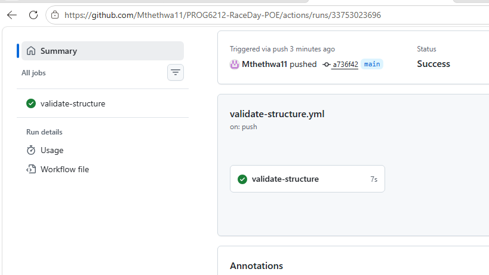

# RaceDay — Event Management System

## PROG6212 Portfolio of Evidence — Part 1: System Planning and Database

## About the System

RaceDay is a full-stack, web-based event management system built for the South African road running, walking, and cycling community. Many community races, walks, and cycling events are still run through paper-based registration, spreadsheets, and disconnected communication channels — RaceDay replaces that with a single platform.

The platform allows **Event Organisers** to create and manage events, categories, and participant results, while **Participants** can browse upcoming events, enter events, track their personal performance history, and prepare for race day using route information.

This Part 1 submission covers the planning phase only — no application code is written yet. It contains:

- An **Entity Relationship Diagram (ERD)** for the full data model
- A structured **API Endpoint Plan** covering every planned endpoint
- A **SQL script** that creates and seeds the full database schema

## Roles

The system supports two distinct user roles, enforced consistently across all three parts of this project:

- **Organiser** — can create, edit, and delete events; manage event categories; capture participant results; and view all event enrolments.
- **Participant** — can create an account, browse events, enter an event by selecting a category, view their own enrolments, and track their personal results.

## Repository Structure

```
/docs
  raceday_erd.drawio      - Entity Relationship Diagram (draw.io source file)
  raceday_erd.png         - Exported ERD image
  api_endpoint_plan.md    - Full API endpoint plan
  raceday_schema.sql      - SQL script (creates and seeds the database)
README.md                 - This file
```

## Database Setup Instructions

1. Open **SQL Server Management Studio (SSMS)** and connect to a local SQL Server instance.
2. Open a new query window.
3. Open `docs/raceday_schema.sql`, copy the contents, and paste them into the query window.
4. Run the script (F5). This creates the `RaceDayDB` database, all six tables with their constraints, and seeds sample data (2 Organisers, 2 Participants, 3 Events, categories, routes, enrolments, and results).

## CI/CD

   

## Video Walkthrough

<!-- TODO: insert unlisted YouTube link here once the video is recorded -->

## AI Tool Disclosure

AI tools (Claude) were used to assist with planning the ERD structure, drafting the API endpoint plan, and generating the initial SQL script. All design decisions were reviewed, understood, and can be explained in the accompanying video walkthrough.